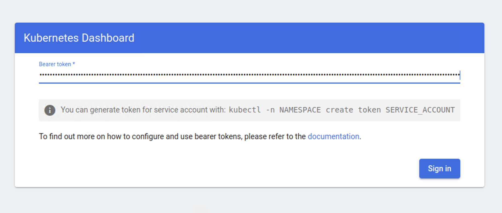
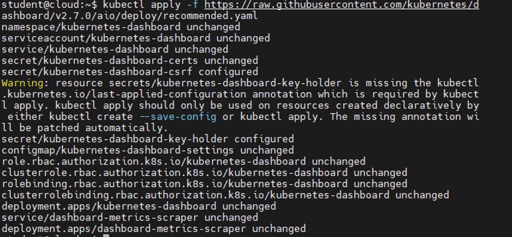
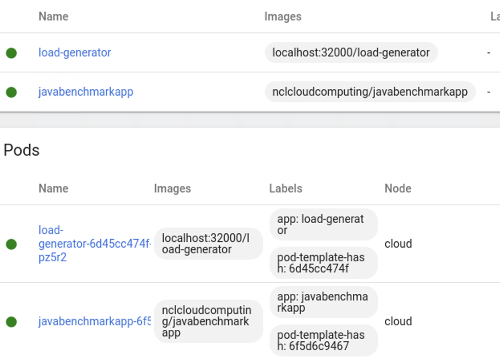
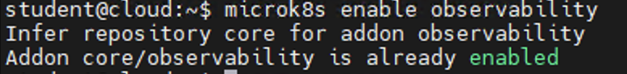
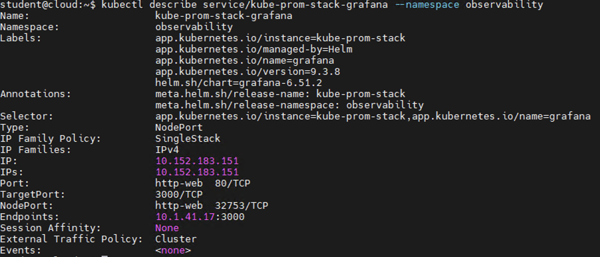
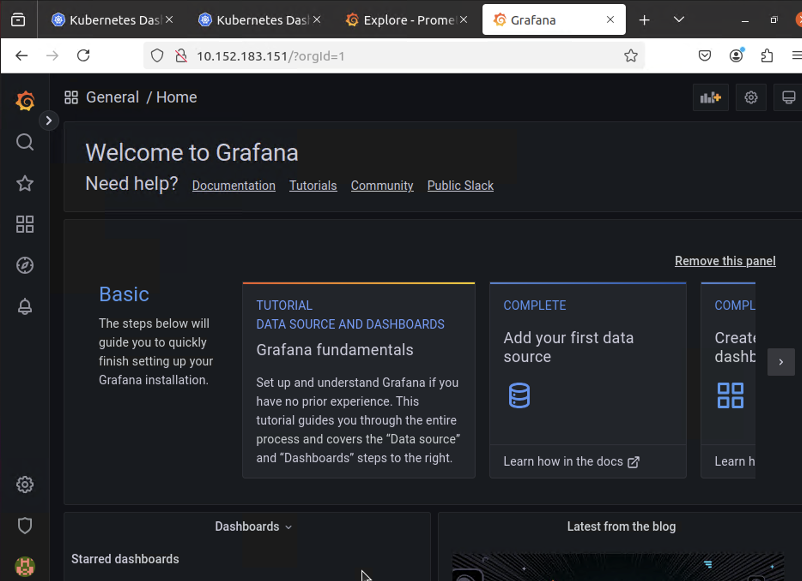
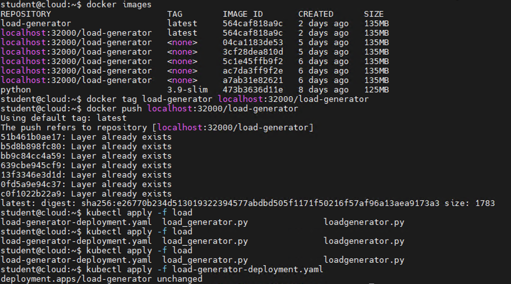
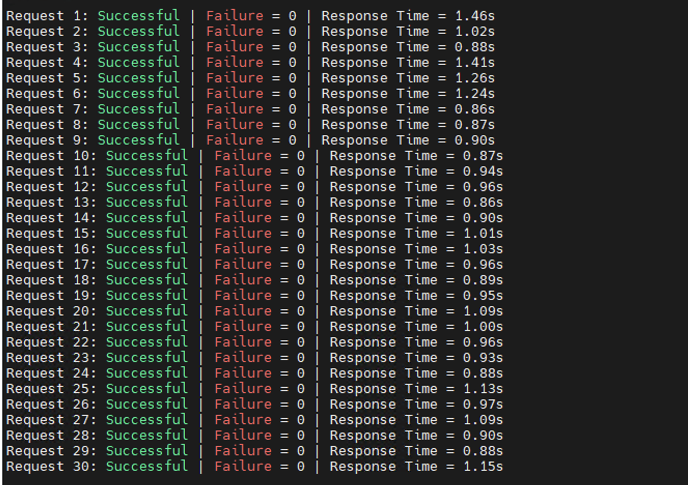
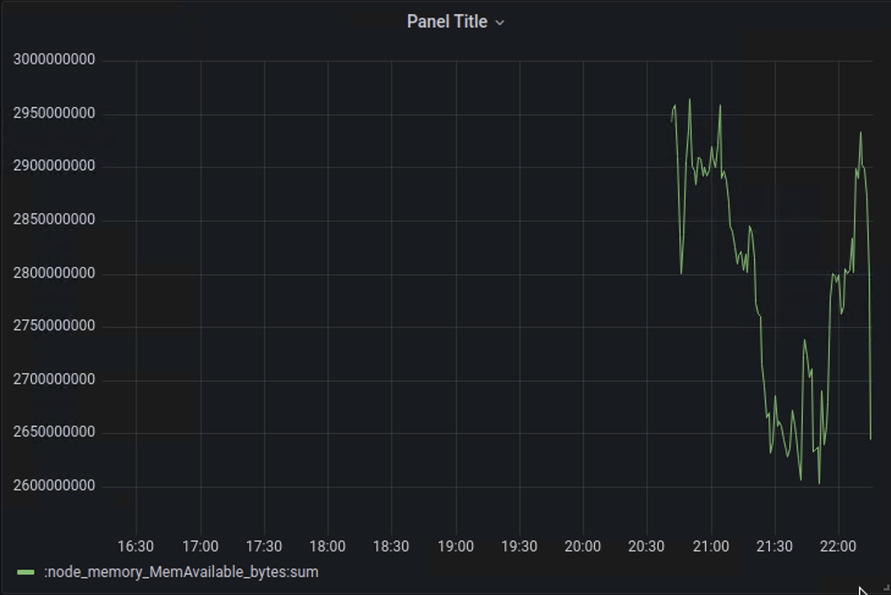

# 📊 Cloud Benchmarking with Kubernetes

This project showcases a Kubernetes-based cloud benchmarking and observability pipeline designed as part of the **CSC8110: Cloud Computing** module at Newcastle University. The goal is to deploy a sample Java benchmarking application, simulate load using a custom Docker-based load generator, and monitor real-time resource usage (CPU, memory) using **Grafana + Prometheus**.

---

## 📌 Features

- ✅ Kubernetes Dashboard access with role-based access setup
- ✅ Java benchmarking app deployed via `Deployment` and `Service`
- ✅ Docker-based Load Generator written in Python
- ✅ MicroK8s Observability Add-on (Grafana + Prometheus)
- ✅ Real-time monitoring of container CPU & memory metrics
- ✅ End-to-end visibility from app to system resources

---

## 🛠️ Tech Stack

| Component             | Tool / Technology                        |
|----------------------|-------------------------------------------|
| Container Platform    | Kubernetes (MicroK8s)                    |
| Monitoring Stack      | Grafana + Prometheus                     |
| Load Simulation       | Python + Docker                          |
| Application Benchmark | Java Benchmark App (PrimeCheck API)      |
| Visualization         | Kubernetes Dashboard, Grafana            |
| Hosting               | Remote Linux VMs (Edge + Cloud setup)    |

---

## 📁 Project Structure
cloud-benchmarking-k8s/
├── README.md
├── CSC8110-Samuel-Pillai-Sathiyamoorthy.pdf
├── k8s-yamls/
│   ├── admin-user.yaml
│   ├── cluster-role-binding.yaml
│   ├── javabenchmarkapp-deployment.yaml
│   ├── javabenchmarkapp-service.yaml
│   └── load-generator-deployment.yaml
├── load-generator/
│   ├── load_generator.py
│   └── Dockerfile
├── docs/
│   ├── dashboard-access.png
│   ├── kubectl-apply-yamls.png
│   ├── get-services-output.png
│   ├── grafana-dashboard-ui.png
│   ├── grafana-service-check.png
│   ├── docker-build.png
│   ├── docker-push.png
│   ├── load-generator-logs.png
│   ├── grafana-cpu-usage.png
│   ├── grafana-memory-usage.png
│   ├── cluster-pod-cpu.png
│   └── cluster-node-memory.png

---

## 📸 Screenshots

### 🔹 Kubernetes Dashboard Access

- Admin Role & Token login  
  

- YAML applied successfully  
  

- Services exposed (NodePort for benchmarking app)  
  

---

### 🔹 Grafana Setup

- MicroK8s Observability Enabled  
  

- Grafana Service NodePort Exposed  
  

- Grafana Interface  
  

---

### 🔹 Load Generator (Python + Docker)

- Load Generator Docker Build  
  

- Docker Push to Local Registry  
  

- Load Generator Logs  
  

---

### 🔹 Observability Dashboard (Task 4)

- 📊 CPU Usage of Java App  
  

- 📈 Memory Usage over time  
  

- 📉 Cluster-wide Pod CPU Limits  
  

- 📊 Cluster Node Memory Available  
  

---

## 🚀 Setup Steps (Summary)

bash
# Apply Kubernetes Dashboard access
kubectl apply -f admin-user.yaml
kubectl apply -f cluster-role-binding.yaml

# Deploy Java benchmarking app
kubectl apply -f javabenchmarkapp-deployment.yaml
kubectl apply -f javabenchmarkapp-service.yaml

# Enable observability on MicroK8s
microk8s enable observability

# Build and push Load Generator Docker image
docker build -t load-generator .
docker tag load-generator localhost:32000/load-generator
docker push localhost:32000/load-generator

# Deploy Load Generator
kubectl apply -f load-generator-deployment.yaml

## 📄 License

This project is released under the MIT License.

⸻

## 👨‍💻 Author

Samuel Sathiyamoorthy
📘 MSc Cloud Computing – Newcastle University
📧 ssamuelpillai@gmail.com